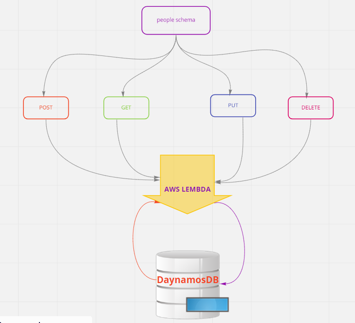

# RESTapi

Auther: Abeer Rafati

This app to explain how to use aws lambada to run app without local server

Routers

get > /people  >> [get all](https://ckx8sdz8gi.execute-api.us-east-1.amazonaws.com/people)   
get > /people/id  >> [get by id](https://ckx8sdz8gi.execute-api.us-east-1.amazonaws.com/people/abbd9482-bb43-43d6-a090-476ca8350d6f)   
post > people >> [post link](https://ckx8sdz8gi.execute-api.us-east-1.amazonaws.com/people)      
put > people/id  >> [edit by id](https://ckx8sdz8gi.execute-api.us-east-1.amazonaws.com/people/abbd9482-bb43-43d6-a090-476ca8350d6f)   
delede > peopele/id >> [delete by id](https://ckx8sdz8gi.execute-api.us-east-1.amazonaws.com/people/abbd9482-bb43-43d6-a090-476ca8350d6f)

### UML 

